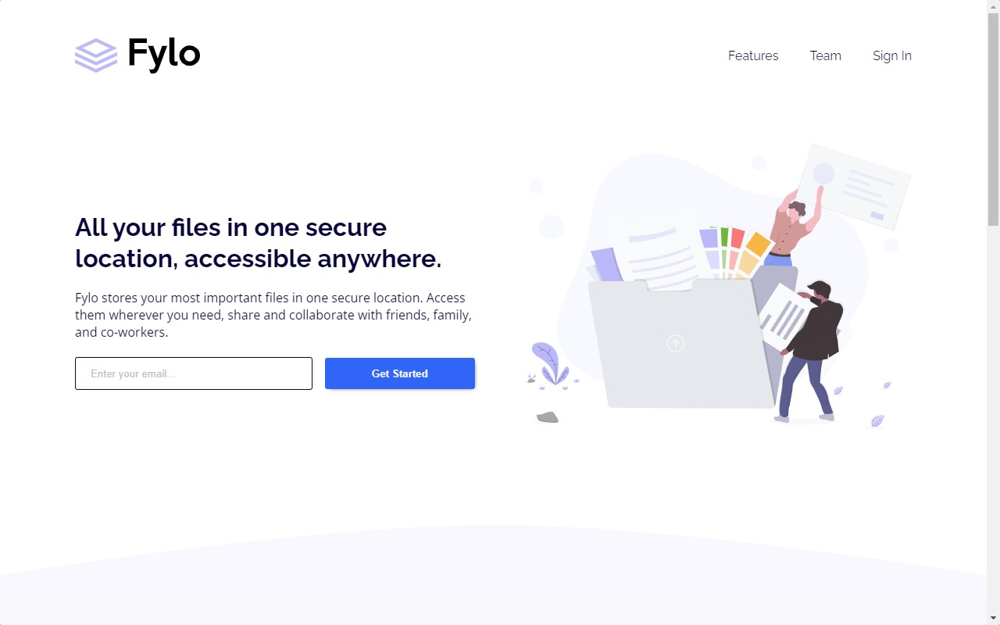

<h1 align="center">
  💻 Fylo Landing Page
</h1>

<h4 align="center"><a href="https://lucasgabriell97.github.io/fylo-landing-page/">Clique para visitar o projeto</a></h4>

## 📚 Sobre o projeto

Esse foi mais um desafio da Frontend Mentor, dessa vez um pouco mais complexo. O projeto se trata de uma landing page responsiva, onde foi feita usando o método mobile first e a 
propriedade flexbox do CSS.

## 💼 Tecnologias utilizadas

- HTML;
- Sass;
